# Collection database and event log

This tool was originally developed for tracking collectibles, progress and event history for gacha-type games. Over time it evolved into a configurable event-tracking database manager. It also works for other activities with date-based events, such as:
- Learning and courses: register courses, track progress through exercises, and log daily activity or milestones
- Collections in general: register acquisitions of items with different values
- Activity tracker: log exercises or challenges and activity goals, with scores and evaluations

<h3 style="text-align:center">Example with imaginary data for learning and courses</h4>
<p style="text-align:center">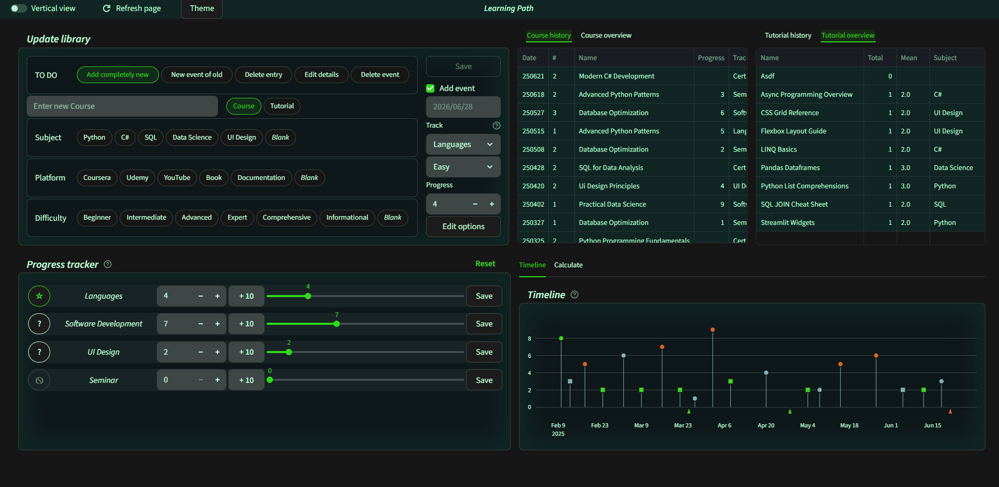</p>

<h3 style="text-align:center">Feature function summary</h4>

<p style="text-align:center">
    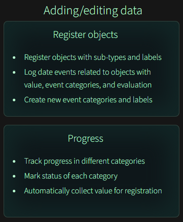
    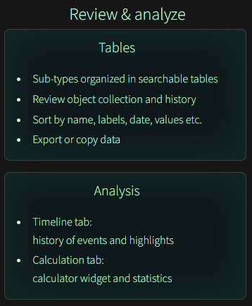
</p>

<!-- <p style="text-align:center"></p> -->


## System overview

This is a modular Python system using the Streamlit API, consisting of two separate sub-systems as well as a few supportive functions; [see file structure](#file-structure).
- Local-first: only installation requires internet connection, all data needed for the main app and wizard are maintained in the PitySake directory
- Pipeline  
    ↓ Installation  
    ⤷ Wizard → Generate local user project  
    ⤷ User projects → Project main app → Data visualization 
- The projects are isolated, but due to local server usage only one can be open at a time

### The project main app

This system runs the UI for projects and manages all editing of project databases.

#### Configuration

- Starts via a unique project main file which connects to a corresponding data folder
    - the system includes "user_project", which serves as template for new main files name after your project
    - "user_project" can be used directly as a generalized system for experiments or smaller projects
- Cache holds static configuration data, databases and processed data
- Streamlit session state holds data accessible for interactive responses and system states

#### Data management

- File management is handled by a separate module, with backups automatically performed at intervals
- Valid user input is controlled in editing features before saving data is enabled
- Data is stored in JSON format but can be copied directly or exported as CSV through the UI

#### Interactive UI: 

- Modular features arranged in horizontal or vertical layout
- Fields are enabled depending on modes and input
- Prompts and dialog boxes are opened for additional functions or confirmations

#### Error management

- Failsafes: various checks during management of files and session states
- Errors are caught by a logging feature and collected by a notification system
- User notifications lists issues with details and advice
- Logging: essential information for troubleshooting errors is stored in log files


### Wizard for new projects

- Multistep form with examples
- Generates project files and folders  
- Creates a template for new projects with the same subject


### Additional files (for Windows)

- Module installer: automatically checks Python and modules required
- Clear cache: in case of persistant bugs, this removes all Python cache files


### Limitations

- This is not a tool for managing and analyzing large data quantities, but for easy logging of smaller scale projects with immediate access to tables and data
- Not optimized for managing multiple projects in open windows simultaneously; close the active project before opening another.
- The [calculator](#calculator) is partially optimized for calculations of defined data sets, and most useful for specific kinds of projects, but a more basic calculator is accessible.


## Installation

### Download

All user data is maintained within the tool folder, while shortcuts can be used for easy access of different projects. Either clone the repository using Git, or [download ZIP](https://github.com/elmwall/PitySake/archive/refs/heads/main.zip) and unpack in suitable folder. Avoid moving the folder after shortcuts are created, otherwise their path need to changed in properties, alternatively start via *your_project.bat*. 


### Requirements

In a terminal, check your Python version:
- `python --verison`  

> In Linux/macOS: write `python3` instead of `python`.

Python can otherwise be installed from [Python.org](https://www.python.org/downloads/). This system is optimized for Windows in Python 3.13.3; minimum Python 3.10 is required for Streamlit. 

Compatibility: the Streamlit part of the system is compatible with Mac/Linux, but not shortcuts (.lnk and .bat files). Use in other operating systems has not been evaluated extensively.

Required Python modules:
- Streamlit version 1.57.0 (functionality may change with newer versions)
- pandas
- plotly
- pyshortcuts
- pywin32 (for Windows)


### Module installation

Windows: start the file *module_installer.bat*. This will run a script automatically checking/installing required modules. This will also place a shortcut *New_Project* to the wizard and a quick start project file shortcut *User_Project* is created in PitySake folder.  

Shortcuts will not work if the PitySake folder is moved after installation. This can be fixed by rightclicking the shortcut > Properties, and change "Start in" field to the new directory or make your own shortcut.

*Alternatively, in a terminal:*  

#### 1. Setup a virtual environment and upgrade pip  

(this keeps installation and modules with specific versions in the local folder)  
with terminal directory set to PitySake folder (`cd path\to\PitySake`):  

- **In Windows:**  
    `python -m venv .venv`  
    `.venv\Scripts\python.exe -m pip install --upgrade pip`  

- **In Linux/macOS:**  
    `python3 -m venv .venv`  
    `.venv/bin/python -m pip install --upgrade pip`  
    
#### 2. Install modules  

- **In Windows:**  
    `.venv\Scripts\python.exe -m pip install -r requirements.txt`  

- **In Linux/macOS:**  
    `.venv/bin/python -m pip install -r requirements.txt`  

- or by module, replace the last sequence:    
    `... -m pip install streamlit==1.57.0`  
    `... -m pip install modulename`  
    where "modulename" is the respective Python module above (pywin32 only for Windows)


## Getting started

Windows: projects and wizard are easiest to launch via shortcuts (*your_project_name.lnk* and *New_Project.lnk*). This will open a terminal running a streamlit session and a browser rendering the app.  

Mac and Linux (and Windows), starting through terminal:  

#### To create a project, run wizard:  
1. set directory to the wizard folder (PitySake\project_utilities)  
2. `.venv/bin/python -m streamlit run project_manager.py`  
#### To run projects,  
1. set directory to the path of your PitySake folder  
2. `.venv\Scripts\python.exe -m streamlit run your_project.py`  
    replace "your_project" with your project file name

> ❗ **Recommended:** start the browser *before* running the script. This way it is less prone to errors due to delays. Also, in some systems, if the script calls the browser, the browser will run as a child process. Terminating/closing the terminal will then close the browser as well.  
> ❗ The terminal must remain open while running the app, else it will become unresponsive.  
> ❗ Close the active terminal before launching another project or the wizard.


### Quick start user project

A generalized system exists ready to use. Run the system via *User_Project* shortcut (after running [*Module_Installer*](#module-installation)) or via *user_project.bat* file.
- Labels, event categories, and value limits must here be added internally


### Wizard - create new or personalized project

- Set your own terminology for items, labels, values, and event categories
- Pre-define limits and highlighting behavior
- Create a new project based on previous ones

The wizard is a six-step form (or single step for re-used settings via template) with explanations and examples, and creates new files and data sets for the new project, as well as shortcuts within the folder and on desktop. 

More details on the wizard [here](#project-installation-wizard).


## User guide

The system uses the following data structure:
- **Main and secondary object:** two over-arching categories of items/subjects
- **Labels:** For searching/sorting tables  
    3 labels for main and 1 label for secondary objects
- **Events:** information attached to registered objects at dates  
    Info attached: event category, value, and outcome evaluation  
    Value and outcome can be disabled for specific categories


### Feature overview

- [Register objects](#object-registration) and/or events
- [Tracking values](#value-tracking): for each event category defined, you can record one active value
- [Tables](#tables): separate tables for main and secondary objects, views all objects and events under separate tabs. 
- [Timeline](#timeline): a view of *all* events in the database
- [Calculator](#calculator): estimate a value from a progression across sets with specific sizes
- [Analysis](#analysis): simple statistics and counts
- [Edit settings](#settings--considerations): dialog boxes for changing options and themes
- Tool-tips: hover above question marks for explanations on context and usage


### Object registration

Through this feature new objects or events can be added, or old ones edited.

- **Labels:** objects *must* be registered with a selection in each available field. You can exclude labels by defining a blank in the [editing feature](#editing-event-categories), or define a label such as "None", "Unavailable" etc.
- **Event category:** Selecting an event category automatically collects the current value of that category from the tracker.  
❗ set the value after category, otherwise it may alter changes you've made in the value field.
- **Outcome:** this will label the event as a positive/neutral/negative outcome
- **Value:** a value between 0 and the limit you have set for the event category


💡 In the [project installation wizard](#project-installation-wizard), counting of objects can be set to count true value, or to count additional instances after the first one.  

<p style="text-align:center">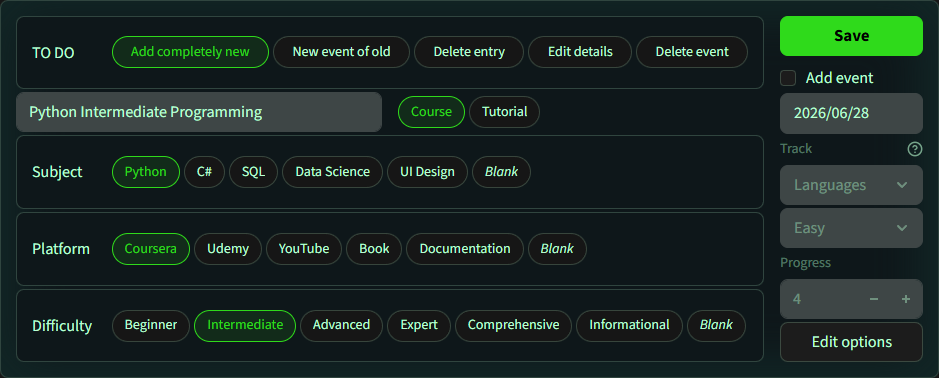</p>


### Value tracking

**Event categories:** Any number of event categories can be created, and set to include/exclude value and evaluation. Each category that include a value has a tracker widget generated, which can be used simply for tracking a value or as a progress bar. 

**Adjust values:** preferably use the slider or enter a value for large changes, and increment buttons for small changes, but they all syncs changes between themselves. 
- Any change enables the *Save* button for that category. The new value is stored only when *Save* is pressed, which lets the user make preliminary adjustments. 
- *Reset* restores values of number input and slider to the saved values.
- The "☆/?" indicator can be used for highlighting the status or importance of a particular tracking.

Each category is defined with an upper limit, setting the value range from 0 to this limit, corresponding to the span of the slider. This works best for known sets of stages or percents. Otherwise, set the limit to a value above expected values, without being unreasonable. 

> ❗ The limit can be set as high as you like, but value highlights in the [timeline](#timeline) are based on percentages of this span. Set the span with this in mind, or disable highlights completely.

<p style="text-align:center">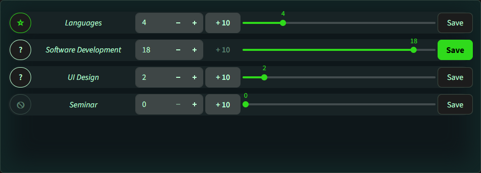</p>


### Tables

One table each for main and secondary categories:
- History: shows all events within the categories
- Overview: shows all registered objects
- Search or sort by any field: event information, name, values, and labels
- Hover over the top right corner for extra search and export
- Data can also be accessed in corresponding JSON file under data or backup in the project folder, see [file structure](#file-structure)
- Mark and copy fields directly


<p style="text-align:center">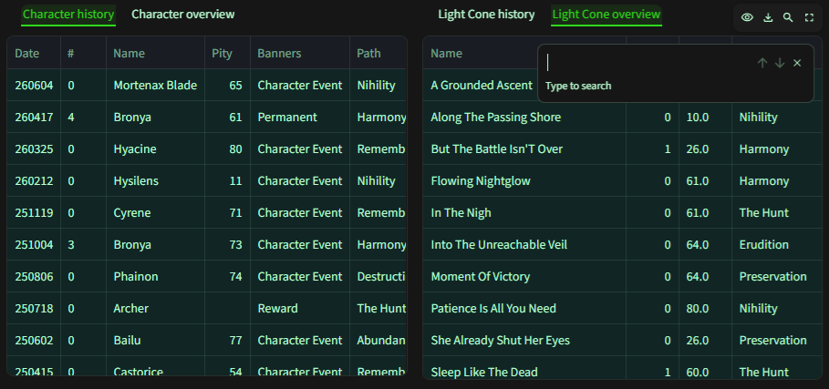</p>


### Timeline

A display of all evets with associated outcomes and values, with indicators for 
- Main (circle) or secondary (square)
- Events without values along the axis (arrows)
- Outcome (fill color)
- Values above/below thresholds (line color)
- Neutral values, neutral outcomes, and events without outcomes shares the neutral color

Hover over the top right corner for extra tools and download as PNG.

High or low value highlights: how these are indicated (e.g. as positive and negative, or the reverse) can be defined in the wizard, and coloring can be set in [Theme settings](#theme).

<p style="text-align:center">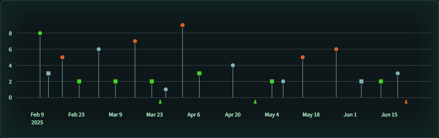</p>


### Calculator

**Set mode:** event categories can be defined with sets consisting of subsets of different length. This feature can calculate a distance across subsets, i.e. from subset X1 position Y1 to subset X2 position Y2. 
- Best used for estimating a progression or amount in-between
- Start from 0 or 1: sets the starting value of the "next" position.
- In *Define sets*, sets can be designed with equal or varying sizes per set
- Restricts input with impossible combination or exceeding limit of the event category selected
- Examples: 
    - Pages with rows, returns number of rows between position  
    e.g. from page 3 row 2 up to page 6 row 7
    - Tasks in different chapters or sections,  
    e.g. clearing a number of exercises in a section. 

**Value mode:** simple calculations of percent, addition, multiplication, or division.

<p style="text-align:center">
    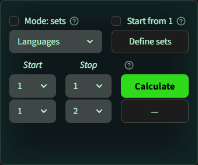
    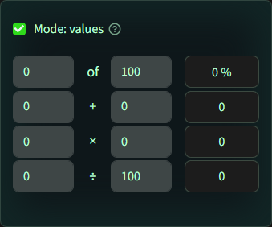
</p>


### Analysis

Calculations for main objects: due to differences in management and values, only main are analyzed.
- Value median
- Last recorded value with comparison to median.  
    If high values are defined as positive in the wizard, an increase is noted as positive, and vice versa.
- Counts of labels

Calculations includig all:
- Sum of all values recorded
- Rate of outcomes

<p style="text-align:center">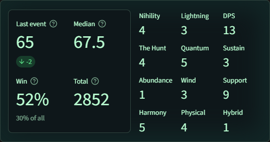</p>


### Settings & considerations

Certain settings can be changed through dialog boxes in the app:

<div style="display: flex; flex-wrap: wrap; align-items: start">
    <table style="min-width: 220px; flex-grow: 1; margin: 0px auto">
        <tr><th style="text-align: center">
            Project settings
        </th></tr>
        <tr><td>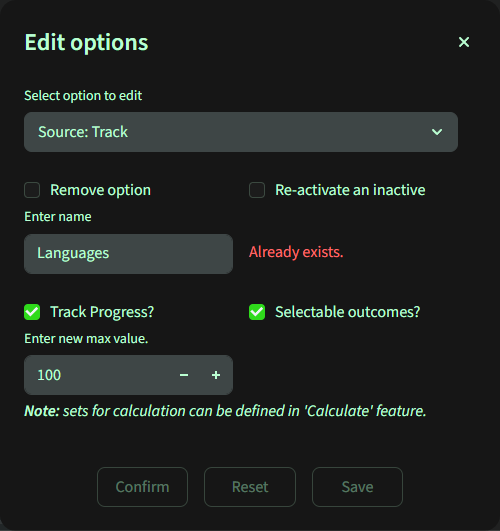<br>
        - Button: 'Edit options' in <i>Update library</i> feature<br>
        - Add/remove labels<br>
        - Add/activate/deactivate event categories<br>
        - Change limits<br>
        - Change highlight settings</td></tr>
    </table>
    <table style="min-width: 220px; flex-grow: 1; margin: 0px auto">
        <tr><th style="text-align: center">
            UI appearance
        </th></tr>
        <tr><td>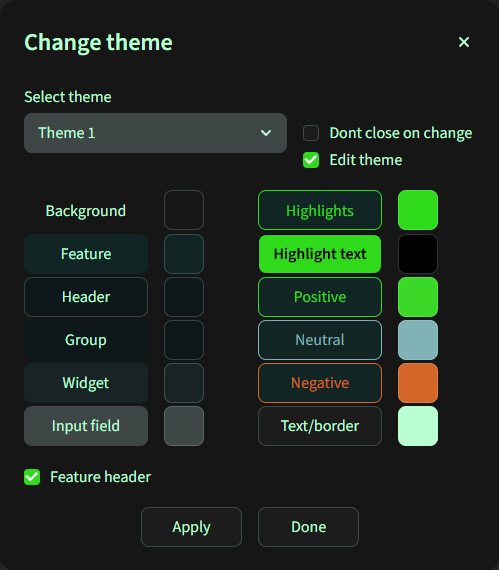<br>
        - Button: 'Theme' in header<br>
        - Switch between different themes<br>
        - Define theme colors<br>
        - Enable/disable feature headers<br></td></tr>
    </table><br>
</div>

#### Labels: add or remove any number of lables, however: 
- The label field expands and can take any number of labels, but a large amount can clutter the view. 
- At least one label in each category is required (3 categories for main, 1 for secondary), although a blank label can be set.
- Labels or event categories removed are still visible in already registered data object data. To change these, use *Edit details* in *Update library* and select other existing options.

#### Editing event categories: 
- For new ones, define whether to enable/disable values and evaluation, and set value limits.
- You can change settings of a category by adding the same category again. Events already registered with the previous version of the category will retain the information they were logged with; to change them you need to remove/re-add those events.
- Once added, event categories cannot be permanently removed due to dependencies with analytical modules. They can instead be deactivated/re-activated, which controls their visibility in the project.

#### Data visualization

- While installing a project you can disable or set thresholds for highlight color coding dependent on values. These settings can be changed later. 
- Decide if you want data points to get an evaluation labeling. Opt out either by using 'neutral' evaluation or by disabling outcome states when defining an event category.

#### Horizontal or vertical layout; [see examples](#whole-page-examples)

- Alter between horizontal and vertical layout via 'Vertical view' switch in the page header.
- Due to complex dependencies, responsiveness to screen size is disabled. For smaller or standing windows, vertical view is more optimal. Zoom in within a vertical layout for enlarged views.

#### Theme

- There are slots for five different themes. These have pre-defined settings, but can all be edited. 
- Themes settings are separate per project, and changes do not carry over. When switching project, the theme is set to the settings of the last theme active within that project. 
- If you want to transfer a precise theme to a new project, either collect the HEX code within the color fields, or copy the whole file ui_themes.json in settings folder of the previous project.


## Troubleshooting

### Lag

Streamlit reruns the page for most interactions and changes in data files. If multiple changes occur in rapid succession it may cause lag - just wait and it should catch up. 

For changing progress values, the slider or entering a number is optimal for large adjustments, and increments for small or precise changes.

While changing theme, due to changes in configuration files there can sometimes be a lag. If it seems to show the wrong colors, refresh the page.


### Crashes

As with lag, during many rapid changes, session states values from individual features can change unexpectedly. Most such are accounted for, but if the system crashes, try the following methods one at the time:
- *Refresh page* button - reloads all states (is usually enough)
- Reload the browser page
- Close the terminal and start the project again
- Remove all `__pychache__` folders (may be hidden). On Windows, use the clean_cache.bat located in the PitySake folder to do this automatically. 


### Errors

> 💡 If an error occurs, try pressing refresh in the header, which may clear temporary disruptions or hickups.  
>
> If you have performed any actions which may clear the error, press refresh to reset the system.

Critical errors will likely only happen if files have been moved or corrupted, which should not happen through normal use. Error messages will inform which files or data are missing. 

Data files can replaced with a backup or generated again (but empty) by saving data, but not configuration files. Those files can be replaced by loading a new project with the template for a previous one, and move the missing settings file to your original project, or your data files to the new. 

<p style="text-align:center">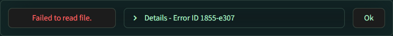</p>

Interruptions while editing is usually not an issue. event categories and tracking are however kept in separate files, and an interruption while adding a new category in *Edit options* could potentially cause only one to be edited, preventing data on that category to be utilized properly. This is easily fixed by adding the same category with the same name again.

<p style="text-align:center">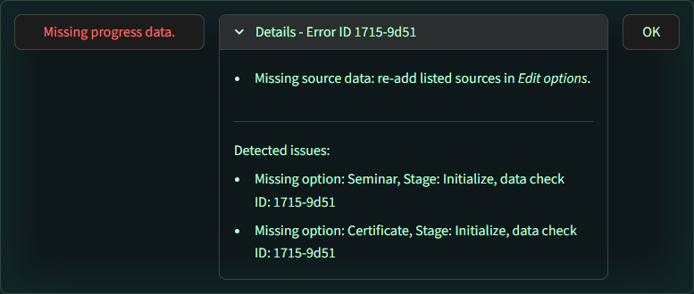</p>


### Data backup

All files modified from within an active project are backed upp. Data options edited will also create backups. A small numeral suffix in the backup indicates most frequent and most likely the latest, otherwise check the last modified date, or the contents using a text editor. Replacing a data file with a backup requires correct naming. Either copy the content of a backup file into a corresponding data file (but be careful of altering the contents), or copy the whole file and change the name. 

Accurate file naming:
- Main object: main.json
- Secondary objects: secondary.json
- Progress/value data: progress.json
- Data options file: data_options.json

There are checks for data health, which alert the user regarding abrubt decrease in content to prevent data from accidentally being overwritten. 

<p style="text-align:center">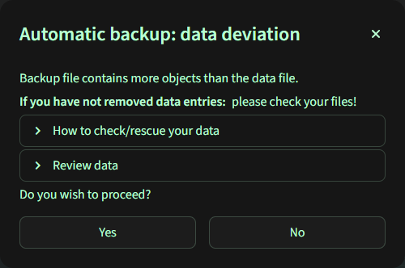</p>


## File structure

Return to [System overview](#system-overview)

```
PitySake/
│
├── <user_project>.py               # Project entry (matching project name)
├── <user_project>.bat              # Windows script for launching project
│
├── app/                            # MAIN APP MODULES
│   │                               # Core
│   ├── project_configuration.py    #   Configures <user_project> -> app -> data
│   ├── file_manager.py             #   Reading/writing/backup
│   ├── data_access.py              #   Cache and forward data
│   ├── initialize.py               #   Session state and cache management
│   ├── style.py                    #   CSS and themes
│   │                               # UI
│   ├── constructor.py              #   Builds UI from modules below
│   ├── object_recorder.py          #   Feature: Update library 
│   ├── object_info_manager.py      #   - library assistant
│   ├── data_viewer.py              #   Feature: Pandas tables
│   ├── progress_tracker.py         #   Feature: tracker widgets
│   ├── timeline.py                 #   Feature: Plotly graph
│   ├── calculate_progress.py       #   Feature: calculator
│   ├── data_analysis.py            #   Feature: statistics
│   │                               # Diagnostics
│   ├── error_handler.py            #   Error responses and messages 
│   └── logger.py                   #   Generate log files
│
│── <user_project>/                 # Data/settings for specific project
│   ├── settings/
│   │   ├── config.json             # Pathways and terms
│   │   ├── data_options.json       # Label and event options
│   │   └── ui_themes.json          # Theme collections
│   ├── data/
│   │   ├── main.json
│   │   ├── secondary.json
│   ∙   └── progress.json
│   └── backup/ ∙∙∙
│
├── project_utilities/              # Project creation wizard
│   ├── project_manager.py          # Wizard entry
│   ├── project_manager.bat         # Winows script 
│   ├── src/ ∙∙∙                    # Form pages -> registration.py
│   ├── utils/
│   │   ├── init.py                 # Session keys and settings
│   │   ├── tools.py                # Toolkit and controls
│   │   └── registration.py         # → <user_project>.py + .bat + .lnk + folder
│   └── shortcut_maker.py           # makes shortcuts to initial .bat files
│
├── requirements.txt 
├── meta.json                       # Last session configurations
├── module_installer.bat            # Windows script for installation
├── clear_cache.bat                 # Windows script for removing __pycache__
∙
├── templates/ ∙∙∙ 
└── logs/ ∙∙∙ 
```


## Project installation wizard

Return to [Getting started](#getting-started)

A project with unique settings and terminology is defined in a six-step form, which more thoroughly explains how to set values and appearance in the project app.
1. Project name and template
2. Object and label names
3. Labels in each category (optional)
4. Terminology
5. Event event categories and value settings:  
    Define category settings: limit, track values/evaluations  
    Set highlight behavior  
    Define start count (is the first object 0 or 1)  
    Value unit: for large or small values  
6. Review and register  
    → project files created  
    → template created  
    → (Windows) shortcut created

> 💡 Individual pages can be revised without affecting the rest, but all fields of that page must then be re-filled.  
> 💡 Invalid or conflicting entries blocks progression, with prompts for which information that needs correction.

<p style="text-align:center">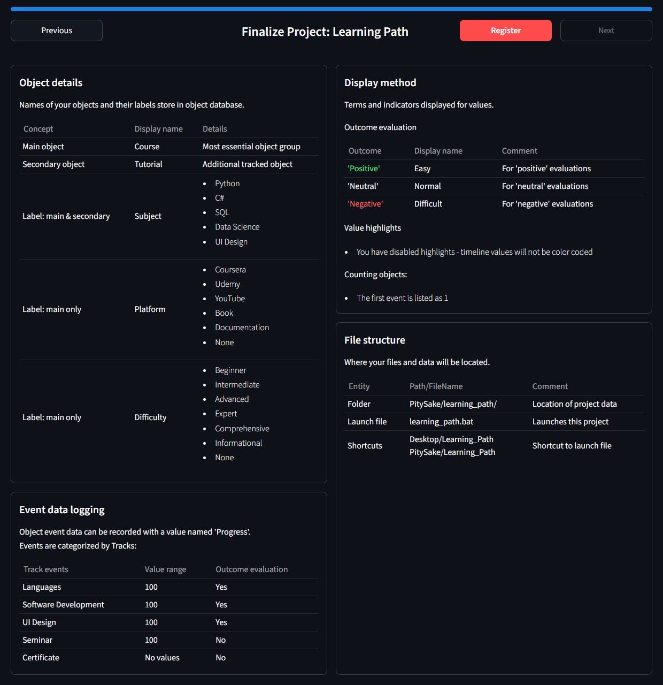</p>


## Whole page examples

### Horizontal view

Example with imaginary data for a game collection database:  
<p style="text-align:center">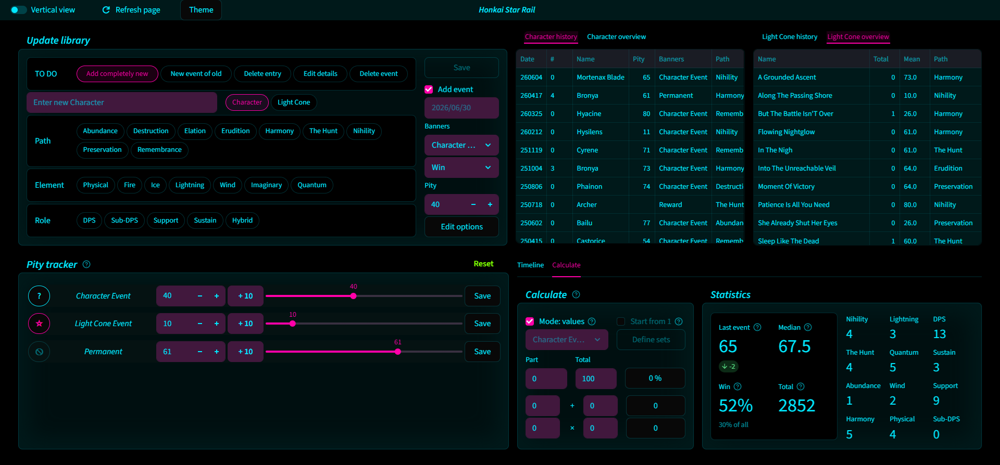</p>

### Vertical view

Vertical view example with imaginary data for learning and courses:  
<p style="text-align:center">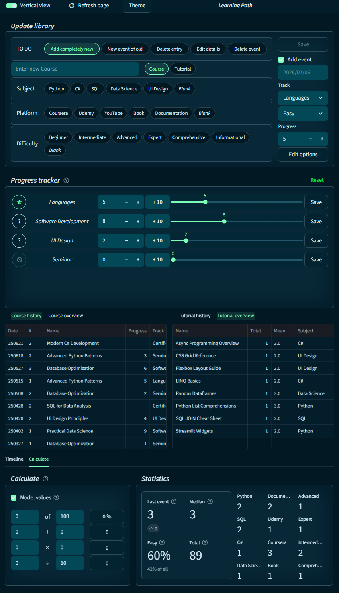</p>

